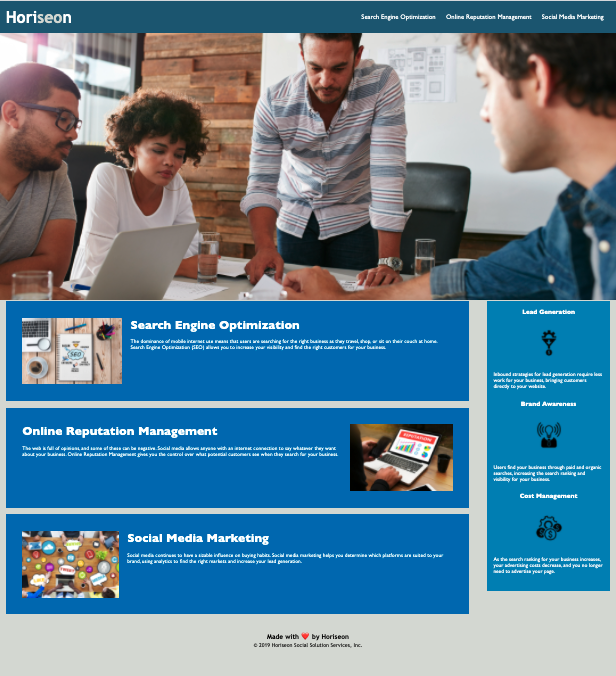

# Site Refactor

## Description

To make this website more accessible to all viewers. 

- What was your motivation?

- Why did you build this project? (Note: the answer is not "Because it was a homework assignment.")

- What problem does it solve?

- What did you learn?

## Old Features -> New Features

- Changed title to Horiseon
- Replaced div w/ header
- Changed div to nav
- Changed div to section
- Changed div to article
- Replaced div to aside
- created a <article>
- cobined the attributes for the following content in css

## Usage
examples for use. 
    

    

